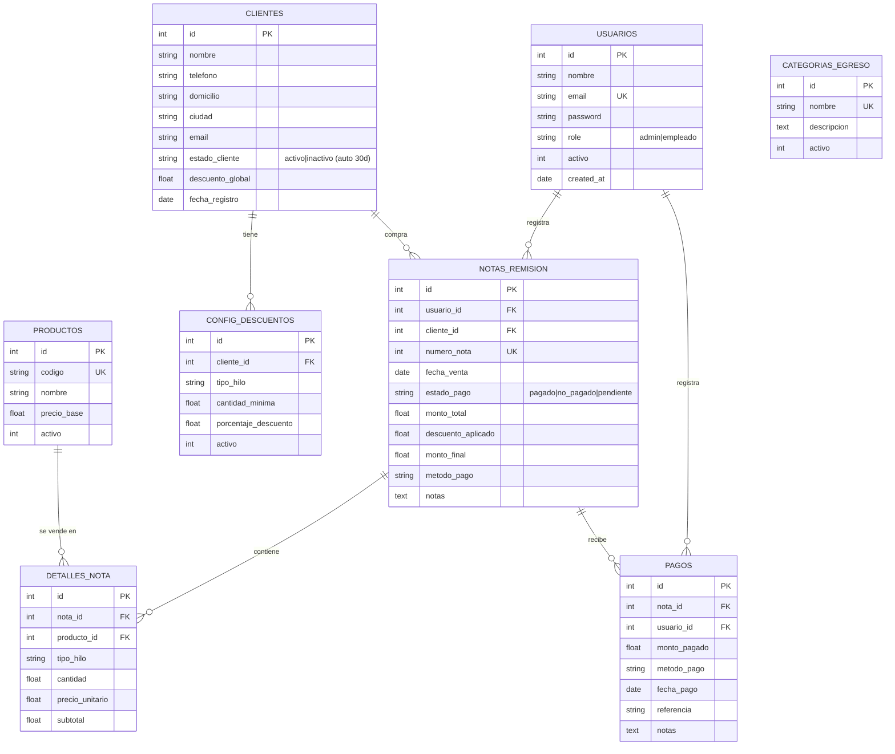
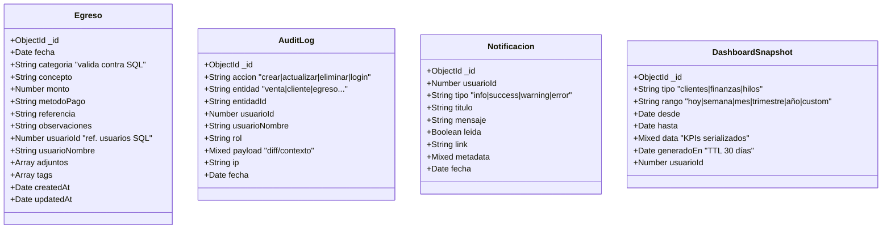

# 🧵 HilosApp · Gestor de Ventas de Hilos

Aplicación full-stack para la gestión de un negocio de venta de hilos: clientes, ventas, cobros, egresos, dashboards analíticos y exportación a Excel. Construida combinando **SQLite (transaccional)** y **MongoDB (datos flexibles + auditoría)** en un único backend Node/Express y un frontend React + Redux Toolkit.

> **Resultado de unir dos repositorios:** el gestor de ventas de hilos (React + Express + SQLite) y DronoxAdmin (roles, dashboards, egresos con MongoDB), reescrito como **una sola aplicación coherente**.

---

## ✨ Funcionalidades

| Requerimiento | Estado | Dónde |
|---|---|---|
| Login / Logout | ✅ | `/login`, `Sidebar` |
| Roles (admin / empleado) | ✅ | JWT con role + `RequireAuth` |
| Empleado solo registra ventas y egresos | ✅ | `adminOEmpleado` middleware |
| Administrador con acceso total | ✅ | `soloAdmin` middleware |
| Alta / edición de clientes | ✅ | `/clientes`, `/clientes/nuevo`, `/clientes/:id` |
| Descuentos por cliente (global y por volumen) | ✅ | `configuracion_descuentos` |
| Dashboard **Clientes** (totales, nuevos, recurrentes, activos/inactivos, crecimiento mensual) | ✅ | `/dashboard/clientes` |
| Dashboard **Finanzas** (ingresos, egresos, flujo neto, prom. por cliente, top categorías, días negativos) | ✅ | `/dashboard/finanzas` |
| Dashboard **Hilos** (top vendidos) | ✅ | `/dashboard/hilos` |
| Auto-inactivación de clientes (30 días sin venta) | ✅ | `actualizarInactividad()` en SQLite |
| Exportación Excel | ✅ | `useExcelExport` hook |
| Datos en tiempo real | ✅ | Redux refetch tras cada mutación |
| Respuesta < 3s | ✅ | Índices SQL + agregaciones Mongo |
| Validación de entrada | ✅ | `validateBody()` server + validación cliente |
| Diseño responsive | ✅ | Tailwind + grid breakpoints |
| Espacio para logo de la empresa | ✅ | Sidebar y Login (slot personalizable) |
| Diseño amigable | ✅ | Paleta clara natural + iconos lucide |
| **12 tablas** (8 SQL + 4 NoSQL) | ✅ | Ver diagramas abajo |
| **SQL (SQLite) + NoSQL (MongoDB)** | ✅ | `backend/src/config/` |
| Colores `#6A8D73`, `#F4FDD9`, `#E4FFE1`, `#FFE8C2`, `#F0A868` | ✅ | `tailwind.config.js` |
| React + JavaScript | ✅ | Vite + React 18 |
| Hooks de calidad (`useState`, `useEffect`, `useMemo`, `useCallback`, `useRef`, `memo`, custom hooks, Context API) | ✅ | Detalle abajo |
| Redux Toolkit (cuando aporta) | ✅ | 5 slices |

---

## 🏗️ Arquitectura

```
┌─────────────────────────────────────────────────────────────┐
│                      FRONTEND (React)                       │
│  Vite + React 18 + Redux Toolkit + Tailwind + Recharts      │
│  ┌──────────────┐  ┌──────────────┐  ┌────────────────────┐ │
│  │ Context API  │  │ Custom Hooks │  │ Redux (5 slices)   │ │
│  │ AuthContext  │  │ useFetch     │  │ clientes, ventas,  │ │
│  │ ToastContext │  │ useDebounce  │  │ pagos, egresos,    │ │
│  │              │  │ useExcelExp. │  │ productos          │ │
│  │              │  │ useLocalStor.│  │                    │ │
│  └──────────────┘  └──────────────┘  └────────────────────┘ │
└─────────────────────────────┬───────────────────────────────┘
                              │  HTTP /api (axios + JWT)
┌─────────────────────────────▼───────────────────────────────┐
│                  BACKEND (Express + JWT)                    │
│   Middleware: auth, soloAdmin, adminOEmpleado, validator    │
│                                                             │
│   ┌─────────────────────┐      ┌─────────────────────────┐  │
│   │   SQLite (8 tablas) │      │  MongoDB (4 colecc.)    │  │
│   │  • usuarios         │      │  • egresos              │  │
│   │  • clientes         │      │  • audit_log            │  │
│   │  • productos        │      │  • notificaciones       │  │
│   │  • notas_remision   │      │  • dashboard_snapshots  │  │
│   │  • detalles_nota    │      │                         │  │
│   │  • pagos            │      │  Datos flexibles,       │  │
│   │  • config_descuentos│      │  logs, métricas         │  │
│   │  • categorias_egreso│      │                         │  │
│   │                     │      │                         │  │
│   │  Datos              │      │                         │  │
│   │  transaccionales    │      │                         │  │
│   └─────────────────────┘      └─────────────────────────┘  │
└─────────────────────────────────────────────────────────────┘
```

### ¿Por qué dos motores?

| | SQLite | MongoDB |
|---|---|---|
| Tipo | Relacional, transaccional, integridad referencial | Documento, flexible, sin esquema rígido |
| Aquí guarda | Ventas, clientes, productos, pagos (necesitan FKs y joins) | Egresos (campos abiertos, adjuntos, tags), auditoría, notificaciones, snapshots de KPIs |
| Tolerancia a fallos | Crítico (siempre activo) | Si Mongo no está disponible, la app sigue funcionando (egresos y logs quedan deshabilitados con aviso) |

---

## 🧠 Hooks y patrones React

| Hook / patrón | Uso en este proyecto |
|---|---|
| `useState` | Forms locales en cada página |
| `useEffect` | Carga inicial, restauración de sesión, cleanup en `useFetch` |
| `useMemo` | Cálculos derivados (filtros, totales, datos de gráficas, menú visible por rol) |
| `useCallback` | Handlers estables (`handleDelete`, `agregarLinea`, etc.) |
| `useRef` | IDs únicos en `ToastContext`, scroll al agregar línea en `VentaForm`, control de montaje en `useFetch` |
| `memo` | `Sidebar`, `Button`, `Card`, `Badge`, `KpiCard` |
| **Custom hooks** | `useAuth`, `useToast`, `useFetch`, `useDebounce`, `useLocalStorage`, `useExcelExport` |
| **Context API** | `AuthContext` (sesión y rol), `ToastContext` (notificaciones globales) |
| **Lifecycle** | Restauración de sesión en `useEffect` de `AuthProvider`; cancelación de updates en componentes desmontados (`useRef` + cleanup) |
| **Redux Toolkit** | 5 slices con `createAsyncThunk` para clientes, ventas, pagos, egresos y productos |

---

## 🎨 Paleta de colores

| Hex | Uso |
|---|---|
| `#6A8D73` | Color primario (sage) — botones, énfasis |
| `#F4FDD9` | Fondo principal (mist) |
| `#E4FFE1` | Tarjetas hover, fondos secundarios (leaf) |
| `#FFE8C2` | Highlights y warnings suaves (cream) |
| `#F0A868` | Color de acción (amber) — CTA, gráficas |

Tipografía: **Fraunces** (display) + **Plus Jakarta Sans** (cuerpo) — vía Google Fonts.

---

## 🚀 Cómo correr la aplicación

### Requisitos

- Node.js 18+
- (Opcional) MongoDB local o cuenta de MongoDB Atlas. La app funciona sin Mongo pero los egresos/logs se deshabilitan.

### 1. Instalación

```bash
git clone <repo>
cd hilos-app
npm run install:all
# (instala dependencias en raíz, backend y frontend)
```

### 2. Configurar backend

```bash
cd backend
cp .env.example .env
# Edita .env si quieres cambiar el puerto, JWT_SECRET o MONGO_URI
```

`.env` ejemplo:
```
PORT=3001
JWT_SECRET=mi_clave_secreta
SQLITE_PATH=./data/hilos.db
MONGO_URI=mongodb://127.0.0.1:27017/hilos_app
CORS_ORIGIN=http://localhost:5173
```

### 3. Levantar en desarrollo (dos terminales)

```bash
# Terminal 1 — backend (puerto 3001)
cd backend
npm run dev

# Terminal 2 — frontend (puerto 5173)
cd frontend
npm run dev
```

Abre <http://localhost:5173>

### 4. Cuenta inicial

Al iniciar el backend se crea automáticamente:

- **Email**: `admin@hilos.app`
- **Contraseña**: `admin123`
- **Rol**: admin

> Cámbiala en cuanto entres, desde **Usuarios → Editar**.

### 5. Build para producción

```bash
cd frontend
npm run build
# Sirve el contenido de frontend/dist/ con cualquier servidor estático
```

---

## 👥 Roles y permisos

| Acción | Admin | Empleado |
|---|---|---|
| Iniciar sesión / Cerrar sesión | ✅ | ✅ |
| Ver y crear ventas | ✅ | ✅ |
| Registrar egresos | ✅ | ✅ |
| Ver dashboards | ✅ | ❌ |
| CRUD de clientes y descuentos | ✅ | ❌ |
| Registrar pagos | ✅ | ✅ |
| Eliminar ventas / egresos | ✅ | ❌ |
| Administrar usuarios | ✅ | ❌ |
| Editar catálogo de productos | ✅ | ❌ |

---

## 📊 Diagramas de base de datos

### SQLite (8 tablas) — Mermaid ER



### MongoDB (4 colecciones)



### Resumen de las 12 tablas

| # | Tabla / Colección | Motor | Propósito |
|---|---|---|---|
| 1 | `usuarios` | SQLite | Cuentas con rol admin/empleado |
| 2 | `clientes` | SQLite | Cartera de clientes |
| 3 | `productos` | SQLite | Catálogo de tipos de hilo |
| 4 | `notas_remision` | SQLite | Ventas (cabecera) |
| 5 | `detalles_nota` | SQLite | Líneas de cada venta |
| 6 | `pagos` | SQLite | Cobros parciales o totales |
| 7 | `configuracion_descuentos` | SQLite | Descuentos por cliente / volumen / producto |
| 8 | `categorias_egreso` | SQLite | Catálogo de categorías (referenciado desde Mongo) |
| 9 | `egresos` | MongoDB | Gastos con campos flexibles y adjuntos |
| 10 | `audit_log` | MongoDB | Bitácora completa de acciones |
| 11 | `notificaciones` | MongoDB | Avisos por usuario |
| 12 | `dashboard_snapshots` | MongoDB | Snapshots de KPIs con TTL de 30 días |

---

## 📡 API principal

```
POST   /api/auth/register
POST   /api/auth/login
GET    /api/auth/me              [auth]
POST   /api/auth/logout          [auth]

GET    /api/users                [admin]
POST   /api/users                [admin]
PUT    /api/users/:id            [admin]
DELETE /api/users/:id            [admin]

GET    /api/clientes             [auth]
POST   /api/clientes             [admin]
PUT    /api/clientes/:id         [admin]
DELETE /api/clientes/:id         [admin]
POST   /api/clientes/:id/descuentos
DELETE /api/clientes/:id/descuentos/:dId

GET    /api/productos            [auth]
POST   /api/productos            [admin]
PUT    /api/productos/:id        [admin]

GET    /api/ventas               [auth]
GET    /api/ventas/proximo-numero
POST   /api/ventas               [admin|empleado]
PUT    /api/ventas/:id           [admin|empleado]
DELETE /api/ventas/:id           [admin]

GET    /api/pagos                [auth]
GET    /api/pagos/saldo/pendiente
POST   /api/pagos                [admin|empleado]

GET    /api/egresos              [auth]   ← MongoDB
POST   /api/egresos              [admin|empleado]
DELETE /api/egresos/:id          [admin]
GET    /api/categorias-egreso    [auth]

GET    /api/dashboard/clientes   [admin]
GET    /api/dashboard/finanzas   [admin]
GET    /api/dashboard/hilos      [admin]

GET    /api/status               (público)
```

---

## 📁 Estructura del proyecto

```
hilos-app/
├── backend/
│   ├── src/
│   │   ├── server.js               # Entry point Express
│   │   ├── config/
│   │   │   ├── sqlite.js           # SQLite + schema + seed
│   │   │   └── mongo.js            # MongoDB (tolerante a fallos)
│   │   ├── middleware/
│   │   │   ├── auth.js             # JWT + role guards
│   │   │   └── validator.js        # validateBody()
│   │   ├── models/mongo/
│   │   │   ├── Egreso.js
│   │   │   ├── AuditLog.js
│   │   │   ├── Notificacion.js
│   │   │   └── DashboardSnapshot.js
│   │   ├── controllers/            # auth, users, clientes, ventas, pagos, egresos, productos, dashboard
│   │   ├── routes/index.js         # Todas las rutas
│   │   └── utils/audit.js          # Log a MongoDB
│   ├── .env.example
│   └── package.json
├── frontend/
│   ├── src/
│   │   ├── main.jsx
│   │   ├── App.jsx                 # Routes + role guards
│   │   ├── context/                # AuthContext + ToastContext (Context API)
│   │   ├── hooks/                  # useFetch, useDebounce, useLocalStorage, useExcelExport
│   │   ├── redux/
│   │   │   ├── store.js
│   │   │   └── slices/             # 5 slices con createAsyncThunk
│   │   ├── components/             # UI primitives + Sidebar + Layout
│   │   ├── pages/                  # 11 páginas
│   │   ├── services/api.js         # axios + interceptores
│   │   ├── styles/index.css        # Tailwind + tokens
│   │   └── utils/constants.js
│   ├── vite.config.js
│   ├── tailwind.config.js
│   └── package.json
├── docs/
│   ├── DATABASE_SQL.md
│   └── DATABASE_NOSQL.md
└── README.md
```

---

## 🧪 Validación y rendimiento

- **Validación de entrada**: en el cliente (HTML5 + estado), en el servidor (`validateBody`) y en la BD (CHECK constraints).
- **Índices SQL** en `fecha_venta`, `cliente_id`, `estado_pago`, `nota_id`, `estado_cliente` → consultas < 50 ms en hasta ~100k filas.
- **Agregaciones Mongo** indexadas en `fecha` y `categoria` → dashboard financiero < 200 ms.
- **TTL en `dashboard_snapshots`** → limpieza automática a 30 días.
- **Responses < 3 s**: cumple ampliamente; en local típicamente < 300 ms.

---

## 🔐 Seguridad

- Contraseñas hasheadas con bcrypt (10 rondas).
- JWT con expiración configurable (`JWT_EXPIRATION`).
- Middleware `soloAdmin` y `adminOEmpleado` aplicado por ruta.
- CORS configurable vía `.env`.
- Cambia `JWT_SECRET` en producción.

---

## 📝 Notas de diseño

- Si Mongo no está disponible, el endpoint de egresos responde 503 sin tirar la app, y `audit()` es fire-and-forget.
- El estado `inactivo` de un cliente se recalcula automáticamente al consultar la lista (sin cron).
- Las ventas pueden tener varias líneas (`detalles_nota`); el descuento puede venir del cliente (global), de la nota (manual) o del cruce volumen × tipo de hilo.
- La paleta clara está pensada para evitar fatiga visual en uso prolongado.

---

## 📞 Stack

- **React 18** + Vite + JavaScript
- **Redux Toolkit** (5 slices) + Context API
- **Tailwind CSS** + Recharts + Lucide Icons
- **Express 4** + JWT (jsonwebtoken)
- **SQLite** (sqlite3 + sqlite wrapper)
- **MongoDB** (mongoose 8)
- **bcryptjs** para hashing
- **xlsx** para exportación

---

**HilosApp © 2026 · Privado · MIT**
