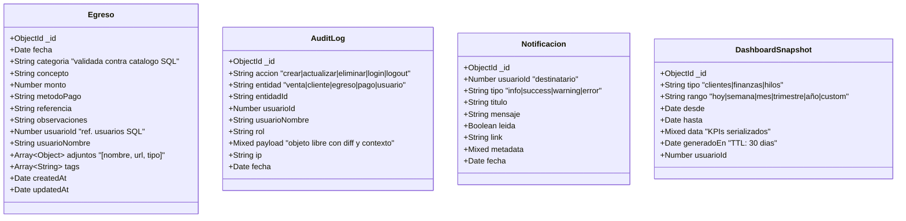

# 🗃️ Base de datos NoSQL (MongoDB)

Motor: **MongoDB 6+** (vía `mongoose 8`).
Configuración: `MONGO_URI` en `backend/.env`.
Inicialización: `backend/src/config/mongo.js` → `initMongo()` se conecta al arrancar el backend.

> **Tolerancia a fallos**: si Mongo no está disponible, la aplicación **sigue funcionando**. Solo los endpoints de egresos responden `503` y los logs de auditoría se omiten silenciosamente. Lo demás (ventas, clientes, pagos, dashboards de clientes y hilos) opera con normalidad sobre SQLite.

## ¿Por qué MongoDB para esto?

Las 4 colecciones aquí cubren información que **no encaja** bien en un modelo relacional rígido:

| Colección | ¿Por qué NoSQL? |
|---|---|
| `egresos` | Cada egreso puede incluir adjuntos, tags y observaciones de longitud variable. Mañana podría tener un campo "factura digital" sin migración. |
| `audit_log` | Volumen alto (cada acción se registra), payload heterogéneo (diff de objetos), append-only. |
| `notificaciones` | Metadata libre por tipo de notificación, lecturas/no leídas con índices ágiles. |
| `dashboard_snapshots` | Estructura de datos completamente variable según el tipo de dashboard; TTL automático nativo. |

---

## Diagrama de colecciones



---

## Detalle por colección

### 1. `egresos`

Cada gasto/salida de dinero. La categoría se valida contra el catálogo `categorias_egreso` de SQLite **antes** de insertar.

```js
{
  _id: ObjectId,
  fecha: ISODate,                 // indexado
  categoria: "Materia prima",     // indexado · validado contra SQL
  concepto: "Compra de hilo crudo",
  monto: 4500.00,
  metodoPago: "transferencia",
  referencia: "FAC-1234",
  observaciones: "Lote de 50 kg",
  usuarioId: 1,                   // referencia al usuario SQLite
  usuarioNombre: "Administrador",
  adjuntos: [
    { nombre: "factura.pdf", url: "...", tipo: "application/pdf" }
  ],
  tags: ["proveedor-x", "lote-50kg"],
  createdAt: ISODate,
  updatedAt: ISODate
}
```

**Índices:**
- `{ fecha: -1 }`
- `{ categoria: 1 }`
- `{ fecha: -1, categoria: 1 }` (compuesto para el dashboard financiero)

### 2. `audit_log`

Bitácora de todas las acciones críticas. Se llama desde `backend/src/utils/audit.js` de manera *fire-and-forget*: si Mongo falla, no rompe la operación principal.

```js
{
  _id: ObjectId,
  accion: "actualizar",           // crear|actualizar|eliminar|login|logout
  entidad: "venta",
  entidadId: "42",                // string para soportar IDs SQL y Mongo
  usuarioId: 1,
  usuarioNombre: "Administrador",
  rol: "admin",
  payload: {                      // objeto libre con el contexto
    estadoPago: "pagado",
    metodoPago: "efectivo"
  },
  ip: "192.168.1.10",
  fecha: ISODate                  // indexado
}
```

**Índices:**
- `{ accion: 1 }`
- `{ entidad: 1 }`
- `{ usuarioId: 1 }`
- `{ fecha: -1 }`

### 3. `notificaciones`

Sistema de avisos por usuario. Útil para alertas (saldo alto, venta confirmada, recordatorio de cobro, etc.). Listo para usarse desde la UI.

```js
{
  _id: ObjectId,
  usuarioId: 1,                   // indexado · destinatario
  tipo: "warning",                // info|success|warning|error
  titulo: "Cliente con saldo alto",
  mensaje: "Pedro García tiene $5,200 pendientes desde hace 45 días",
  leida: false,                   // indexado
  link: "/pagos?clienteId=12",
  metadata: { clienteId: 12, monto: 5200 },
  fecha: ISODate
}
```

**Índices:**
- `{ usuarioId: 1 }`
- `{ leida: 1 }`
- `{ fecha: -1 }`

### 4. `dashboard_snapshots`

Cachés de KPIs precalculados para acelerar la carga de dashboards o conservar histórico de cómo se vio el negocio en un momento dado.

```js
{
  _id: ObjectId,
  tipo: "finanzas",               // clientes|finanzas|hilos
  rango: "mes",                   // hoy|semana|mes|trimestre|año|custom
  desde: ISODate,
  hasta: ISODate,
  data: {                         // estructura libre por tipo
    kpis: { totalIngresos: 48200, totalEgresos: 12300, ... },
    topCategorias: [ ... ],
    diasNegativos: [ ... ]
  },
  generadoEn: ISODate,            // indexado · usado por TTL
  usuarioId: 1
}
```

**Índices:**
- `{ tipo: 1 }`
- `{ generadoEn: 1 }` con **TTL de 30 días** → MongoDB borra los snapshots viejos automáticamente.

```js
DashboardSnapshotSchema.index(
  { generadoEn: 1 },
  { expireAfterSeconds: 60 * 60 * 24 * 30 }
);
```

---

## Referencias cruzadas con SQLite

Mongo no tiene foreign keys reales, así que las referencias se hacen por convención:

| Campo en Mongo | Apunta a | Validación |
|---|---|---|
| `egresos.categoria` (string) | `categorias_egreso.nombre` (SQLite) | Antes de cada INSERT, el controlador consulta SQL y rechaza categorías inválidas |
| `egresos.usuarioId` (number) | `usuarios.id` (SQLite) | Tomado del JWT verificado |
| `audit_log.usuarioId` (number) | `usuarios.id` (SQLite) | Tomado del JWT verificado |
| `notificaciones.usuarioId` (number) | `usuarios.id` (SQLite) | Asignado al crear la notificación |

Esto mantiene la integridad sin acoplar los dos motores, y permite que SQLite sea la fuente de verdad para entidades de negocio.

---

## Manejo de fallos

`backend/src/config/mongo.js` no aborta el proceso si Mongo no responde:

```js
try {
  await mongoose.connect(uri, { serverSelectionTimeoutMS: 5000 });
  connected = true;
} catch (err) {
  console.warn('⚠️  MongoDB NO disponible. La app sigue funcionando…');
  connected = false;
}
```

- Los endpoints de `/api/egresos` responden `503` con un mensaje claro.
- `audit()` simplemente no escribe.
- El dashboard financiero muestra los ingresos (SQL) y omite la sección de egresos.

Esto permite levantar la aplicación en máquinas que solo tengan SQLite, útil para demos o instalaciones mínimas.

---

## Backup

Comando recomendado:

```bash
mongodump --uri="mongodb://127.0.0.1:27017/hilos_app" --out=./backup-mongo-$(date +%F)
```

Para restaurar:

```bash
mongorestore --uri="mongodb://127.0.0.1:27017/hilos_app" ./backup-mongo-FECHA/hilos_app
```
