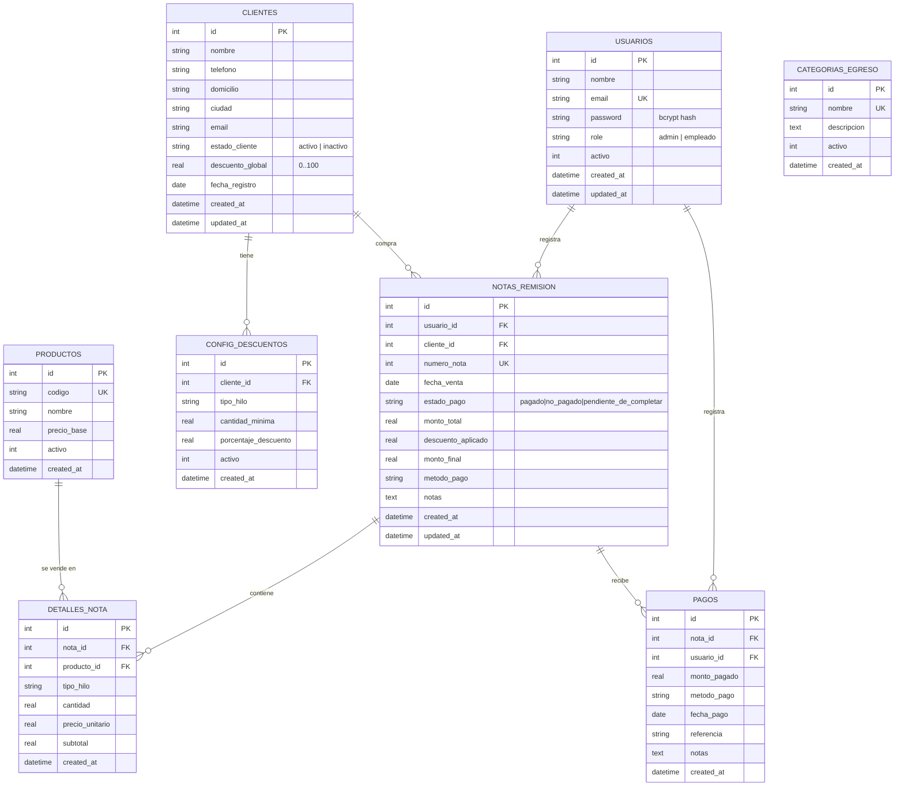

# 🗄️ Base de datos SQL (SQLite)

Motor: **SQLite 3** (via `sqlite` + `sqlite3` para Node).
Ubicación por defecto: `backend/data/hilos.db` (se crea automáticamente al iniciar el backend).
Inicialización: `backend/src/config/sqlite.js` → `initSQLite()` ejecuta `createSchema()` + `seedDefaults()` en cada arranque.

## ¿Por qué SQLite para esto?

Los datos transaccionales del negocio (clientes, ventas, pagos, productos) **exigen**:
- Integridad referencial (FKs reales)
- Transacciones ACID al crear una venta + sus detalles + el pago
- Joins frecuentes para dashboards y reportes
- Esquema estable y predecible
- Cero costo operativo: un solo archivo, sin servidor que mantener

SQLite cubre las cuatro necesidades sin la complejidad de un Postgres/MySQL.

---

## Diagrama Entidad-Relación



---

## Detalle por tabla

### 1. `usuarios`
Cuentas con autenticación y rol. El primer usuario registrado se convierte en **admin** automáticamente.

| Columna | Tipo | Restricciones |
|---|---|---|
| `id` | INTEGER | PK AUTOINCREMENT |
| `nombre` | TEXT | NOT NULL |
| `email` | TEXT | UNIQUE NOT NULL |
| `password` | TEXT | NOT NULL · hash bcrypt |
| `role` | TEXT | DEFAULT 'empleado' · CHECK IN (admin, empleado) |
| `activo` | INTEGER | DEFAULT 1 |
| `created_at`, `updated_at` | DATETIME | CURRENT_TIMESTAMP |

### 2. `clientes`
Cartera. El campo `estado_cliente` se recalcula automáticamente: pasa a `inactivo` si el cliente no tiene ventas en los últimos 30 días, y vuelve a `activo` cuando registra una.

| Columna | Tipo | Restricciones |
|---|---|---|
| `id` | INTEGER | PK |
| `nombre` | TEXT | NOT NULL |
| `telefono`, `domicilio`, `ciudad`, `email` | TEXT | opcionales |
| `estado_cliente` | TEXT | CHECK IN (activo, inactivo) |
| `descuento_global` | REAL | DEFAULT 0 · 0..100 |
| `fecha_registro` | DATE | DEFAULT CURRENT_DATE |

### 3. `productos`
Catálogo de tipos de hilo. Seeded con 7 productos base (Número 20–100, Pabilo, Especial).

| Columna | Tipo | Restricciones |
|---|---|---|
| `id` | INTEGER | PK |
| `codigo` | TEXT | UNIQUE NOT NULL · ej. HILO20 |
| `nombre` | TEXT | NOT NULL |
| `precio_base` | REAL | DEFAULT 0 |
| `activo` | INTEGER | DEFAULT 1 |

### 4. `notas_remision`
Cabecera de cada venta. `numero_nota` es único y autoincremental (gestionado en el controlador).

| Columna | Tipo | Restricciones |
|---|---|---|
| `id` | INTEGER | PK |
| `usuario_id` | INTEGER | FK → usuarios.id |
| `cliente_id` | INTEGER | FK → clientes.id |
| `numero_nota` | INTEGER | UNIQUE NOT NULL |
| `fecha_venta` | DATE | NOT NULL |
| `estado_pago` | TEXT | CHECK IN (pagado, no_pagado, pendiente_de_completar) |
| `monto_total` | REAL | NOT NULL · subtotal sin descuento |
| `descuento_aplicado` | REAL | DEFAULT 0 |
| `monto_final` | REAL | NOT NULL · monto_total - descuento_aplicado |
| `metodo_pago` | TEXT | nullable |
| `notas` | TEXT | nullable |

### 5. `detalles_nota`
Cada línea de producto dentro de una venta. ON DELETE CASCADE: al borrar una nota se borran sus detalles.

| Columna | Tipo | Restricciones |
|---|---|---|
| `id` | INTEGER | PK |
| `nota_id` | INTEGER | FK → notas_remision.id · CASCADE |
| `producto_id` | INTEGER | FK → productos.id · SET NULL |
| `tipo_hilo` | TEXT | NOT NULL (texto libre por compatibilidad) |
| `cantidad` | REAL | NOT NULL |
| `precio_unitario` | REAL | NOT NULL |
| `subtotal` | REAL | NOT NULL · cantidad × precio_unitario |

### 6. `pagos`
Cobros (totales o parciales). Una nota puede tener varios pagos hasta cubrir el `monto_final`.

| Columna | Tipo | Restricciones |
|---|---|---|
| `id` | INTEGER | PK |
| `nota_id` | INTEGER | FK → notas_remision.id · CASCADE |
| `usuario_id` | INTEGER | FK → usuarios.id |
| `monto_pagado` | REAL | NOT NULL |
| `metodo_pago` | TEXT | NOT NULL |
| `fecha_pago` | DATE | NOT NULL |
| `referencia` | TEXT | opcional (folio, transacción) |

### 7. `configuracion_descuentos`
Reglas de descuento adicionales por cliente, por tipo de hilo o por volumen. Se aplica el **mayor** entre el descuento global del cliente y el aplicable de esta tabla.

| Columna | Tipo | Restricciones |
|---|---|---|
| `id` | INTEGER | PK |
| `cliente_id` | INTEGER | FK → clientes.id · CASCADE |
| `tipo_hilo` | TEXT | opcional (null = cualquiera) |
| `cantidad_minima` | REAL | DEFAULT 0 |
| `porcentaje_descuento` | REAL | NOT NULL |
| `activo` | INTEGER | DEFAULT 1 |

### 8. `categorias_egreso`
Catálogo SQL referenciado desde MongoDB. Garantiza que los egresos solo usen categorías válidas. Seeded con 8 categorías (Materia prima, Logística, Sueldos, Renta, etc.).

| Columna | Tipo | Restricciones |
|---|---|---|
| `id` | INTEGER | PK |
| `nombre` | TEXT | UNIQUE NOT NULL |
| `descripcion` | TEXT | opcional |
| `activo` | INTEGER | DEFAULT 1 |

---

## Índices

Creados automáticamente para optimizar las consultas más frecuentes:

```sql
CREATE INDEX idx_nota_fecha     ON notas_remision(fecha_venta);
CREATE INDEX idx_nota_cliente   ON notas_remision(cliente_id);
CREATE INDEX idx_nota_estado    ON notas_remision(estado_pago);
CREATE INDEX idx_detalle_nota   ON detalles_nota(nota_id);
CREATE INDEX idx_pago_nota      ON pagos(nota_id);
CREATE INDEX idx_cliente_estado ON clientes(estado_cliente);
```

Permiten que los dashboards y listados respondan en <100ms con miles de filas.

---

## Datos sembrados (seed)

Al iniciar, si las tablas están vacías:

**Usuario admin**
```
email:    admin@hilos.app
password: admin123
role:     admin
```

**Productos** (7 tipos): Número 20, 30, 40, 60, 100, Pabilo, Especial.

**Categorías de egreso** (8): Materia prima, Logística, Sueldos, Renta, Servicios, Mantenimiento, Marketing, Otros.

---

## Transacciones

La creación de una venta usa `BEGIN / COMMIT / ROLLBACK` para garantizar atomicidad:

```js
await db.exec('BEGIN');
// INSERT en notas_remision
// INSERT múltiple en detalles_nota
// INSERT opcional en pagos (si estado = pagado)
await db.exec('COMMIT');
// Si algo falla → ROLLBACK
```

---

## Backup

Un backup del archivo `backend/data/hilos.db` es suficiente para preservar todos los datos transaccionales. La aplicación permite además exportación a Excel de cualquier vista (clientes, ventas, pagos, egresos).
